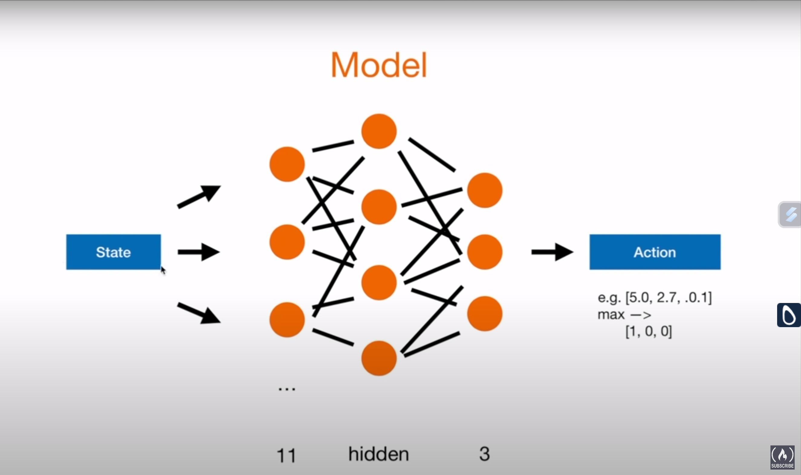
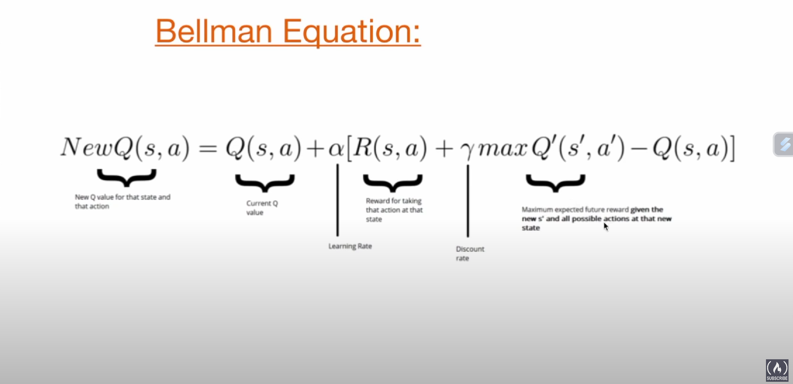

# Reinforcement Learning        
- Reference - [Python Engineer](https://github.com/patrickloeber/snake-ai-pytorch/tree/main)

 >*Reinforcement  learning is teaching a software to behave in an environment based on how good it is doing.*

Here we use **Deep Q Learning** which is an appraoch that extends reinforcement learning by using a deep neural network to predict the actions.

## Run 

```
python agent.py
```

## Aim

To understand the basic working of a reinforcement learning model.
## Theory

Our project consists of 3 main parts
- **Game (using Pygame)**
    - play_step(action)
        - reward, game_over, score
- **A Model** (using PyTorch)
    - Linear_QNet (DQN) [Feed forward neural network]
        - model.predict(state) -> action
- **An Agent** (using both the above)
    - Game
    - model <br>
    **Training**
    - state = get_state(game)
    - action = get_move(state):
        - model.predict()
    - reward, game_over. score = game.play_step(action)
    - new_state = get_state(game)
    - remember
    - model.train() -> simple feed forward neural network

    ### Rewards
    - eat food = +10
    - game over = -10
    - else = 0
    ### Actions
    - [1, 0, 0] -> Straight
    - [0, 1, 0] -> right turn
    - [0, 0, 1] -> left turn 
    <br>
    Depended on the current direction. <br>
    ++ Cannot go 180` turn if done this way

    ### state(11 values)
    [danger straight, danger right, danger left,
    
    direction left, direction right,
    direction up, direction down,
    
    food left, food right,
    food up, food down
    ]

    ### Model
    

    #### Deep Q learning
    Q value = Quality of action

    0. Init Q value(=init model)
    1. choose action (model.predict(state)) <-> or a random move
    2. Perform action
    3. Measure reward
    4. Update Q value (+train model)

    > 4->1->4->1... Iterative learning step

    ### Bellman Equation
    
    Q = model,predict(state<sub>0</sub>) <br>
    Q<sub>new</sub> = R + gamma.max(Q(state<sub>1</sub>))
    <br><br>
    **Loss function** - Mean squared error

    loss = (Q<sub>new</sub> - Q)<sup>2</sup>

## Implementat the Game

**Requirements**
- Python 3.7 (virtual env) 
- matplotlib, ipython
```
pip install matplotlib ipython
```
- Pytorch (No cuda)
```
pip3 install torch torchvision
```
- pygame
```
pip install pygame
```
- Human playable [Snake game GitHub repo](https://github.com/patrickloeber/python-fun/tree/master/snake-pygame) (by Python Engineer)


**Approach** (editing human played snake game)
1. reset() - to reset all the parameters once the game is lost
    - Create a variable frame_iteration to keep track of the frame iteration. 

2. remove the "main" function - no user input required

3. Change move()
    - replace the human input *direction* arguement by *action* agent input
    - To move the snake we design an algorithm to move straight, turn right and left
        - define directions in a clockwise order [ r, d, l, u]
        - current index/direction 
        - if straight -> [1,0,0]: new direction = current direction
        - if right -> [0,1,0]: new direction = clockwise[(curr_index+1) % 4] 
        - if left -> [0,0,1]: new direction = clockwise[(curr_index-1) % 4]
4. Change play_step(action) -> direction 
    - adding a reward parameter
        - if collision: reward = -10
        - if no collision: reward = 0
        - if food eaten: reward = +10
    - To make sure the snake dont keep increasing in size indefinitly we cap it at 100*len(snake) using frame_iteration. 
    - Add +1 to the frame_iteration every time the function gets executed
    - Also return reward along with game_over state and score
5. Change _is_collision()
    - To give the AI some context about the environment, we create a point pt which keeps track of hitting the boudaries or on itself
    - should be made public, so remove "_"

## Implement the agent

Import necessary packages
- torch
- numpy
- deque from collections
- game (we just created)

Functions inside class Agent
- init() -> 
    - no_of_games
    - epsilon (amount of randomness)
    - gamma (discount rate)
    - memory (if exceeded will deque or pop from left)
- get_state () -> calculate 11 different state
- remember () -> save all the values [state, action, reward, next_state, done]
- train_long_memory ()-> train on the long memory
- train_short_memory () -> train after each game
- get_action () -> 
    - Logic to come up with a tradeoff between randomness and prediction  called exploration vs exploitation
    - **Predict** the next step using current state information -> [1,0,0] or [0,1,0] or [0,0,0]


**Main function**
- train() -> plot_score, mean, total score, record
    - Get old state
    - Get next move using the existing state as input 
        -  _get_action(self, state)_ ->**(prediction)**
    - Perform this step in the game and record -> reward, score and done status
    - Get a new state

    _Using this change in state we train the short term memory of the model._
    - train_short_memory()

    We also store everything in memory.
    - remember()

    Experienced replay -> if one whole game is finished we train the long term memory
    - reset the game
    - count the number of games played
    - train_long_memory
        - take a sample of the memory (Batch size defined) and use it to train our model
    - if scored more than precious high score : save the model

## Implement the model
 
Import necessary packages
- torch
- torch.nn
- torch.nn.funcitonal
- torch.optim
- os

Class Linear_QNet
- _init_ -> first and second layer of the neural network is initialized
- Feed forward network ->using the layers initialized above
- save the model

Class QTrainer
- _init_ -> 
    - learning rate
    - gamma parameter or discount rate (must be smaller than 1)
    - model
    - **adam optimizer**
    - Criterion -> **Mean squared error loss function**
- train_step() -> convert all parameters into tensors
- Make it into the shape that can be fed into the model
    - Use torch.unsqueeze()
- Predict the Q values with the current state
- Use the bellman equation, Q<sub>new</sub> = r + y *max(next_predicted Q value) 

## Conclusion

Understood the basic modus operandi when training a reinforcement Deep Q learning system.

Currently the model saturates its learning at around an average score of 28-29 and a max score of 89 was achieved within 15 mins of training with around 450 games played.
Further fine tuning of the neural network parameters can help achieve a better result. Will continue palying with it to find those.

Noticed that even after increasing the speed of the game to 10000x and though the model is trained just on the CPU, the usage caps at around 60% on Ryzen 9 processor. The pygame itself takes around one sec to update the UI after each game is lost. This time cannot be minimized further with the current setup even if we increase computational power. Can look for other method to further reduce that time.

The tradeoff between exploration and exploitation is an important topic in Deep Q learning / reinforcement learning as it determines when the randomness stops and when you start trusting the prediction. The reward based continuous learning seems like an interesting topic to work on. Looking for opportunities to learn more on this topic.

Feel free to reach out if you have any queries regarding the code or an interesting project that we can work on.


